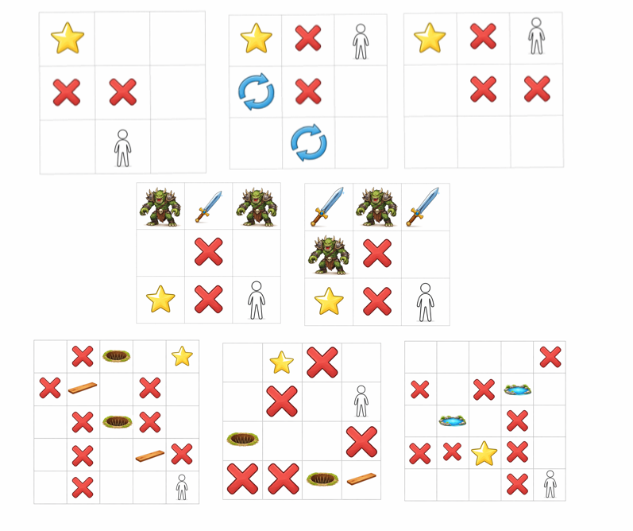

# CIPHERGRID

CIPHERGRID is a multimodal rule-inference and path-finding benchmark. A model must infer a latent symbolic vocabulary from fixed text-and-image demonstrations, decode a new grid world, apply the game rules, plan a valid route, and return the solution in the same encoded action language.

A canonical answer looks like:

```text
ma-ga-ga-ya-va-ba-ma
```

The repository contains the benchmark-generation, vocabulary-remapping, model-running, response-cleaning, validation, and error-analysis utilities used by the project. Benchmark datasets and experiment outputs are expected to be stored separately.



## Repository layout

```text
.
├── README.md
├── assets/
│   ├── CipherGrid_Image_Examples.png
│   └── prompt
├── alternative_ciphers/
│   ├── abstract_symbols_1.json
│   ├── abstract_symbols_2.json
│   ├── english_letters.json
│   ├── numbers.json
│   └── manifest.json
├── custom_vocabulary.example.json  # Human-readable schema reference
├── solver.py
├── decode_world.py
├── encode_script.py
├── map_generator.py
├── generate_worlds.py
├── make_jsonl.py
├── add_sequential_ids_in_place.py
├── apply_custom_vocabulary.py
├── restore_canonical_vocabulary.py
├── restore_csv_responses_to_canonical.py
├── parse_response_csv.py
├── validate_solutions.py
├── validate_by_size.py
├── diagnose_error_types_with_empty.py
├── run_openai_responses_repo.py
├── run_qwen_ciphergrid_repo.py
├── run_claude_main_repo.py
└── run_gemini_main_repo.py
```

Recommended local directories:

```text
data/          # Benchmark JSONL files and intermediate generation files
results/       # Raw, cleaned, and restored model outputs
validation/    # Per-record and grouped validation CSVs
logs/          # Provider failure logs
```

## Canonical symbolic language

### Row marker and tile tokens

Canonical grid rows use the marker `wa:` followed by hyphen-delimited tile tokens.

```text
wa:na-pa-pa-ca
wa:ca-pa-da-ca
```

| Token | Meaning |
|---|---|
| `wa` | Row marker |
| `pa` | Open tile |
| `ca` | Wall |
| `na` | Start |
| `da` | Goal |
| `ea` | Monster |
| `xa` | Reversal tile |
| `oa` | Sword |
| `la` | Plank |
| `ha` | Water |
| `ka` | Trap |

Compact benchmark queries remove the colons, hyphens, and row boundaries. For example:

```text
wanapapacawacapadaca
```

### Action tokens

| Token | Action |
|---|---|
| `ma` | Move up |
| `ga` | Move right |
| `za` | Move left |
| `va` | Move down |
| `ya` | Pick up an item |
| `ba` | Attack |
| `sa` | Place a plank |
| `ra` | Swim |
| `ta` | Resign / report no solution |

Actions are serialized with hyphen separators:

```text
ma-ga-va-sa-ra
```

## Game mechanics implemented by the solver

The canonical rules are centralized in `solver.py`.

- A model begins empty-handed and can carry at most one item.
- Picking up a sword or plank is optional and is only legal while empty-handed.
- A live monster can only be entered while holding a sword. The monster must then be attacked before leaving its tile, and the sword is consumed.
- An uncovered trap can only be entered while holding a plank. The plank must then be placed before leaving the tile, and the plank is consumed.
- Directional movement is illegal while standing on water. `ra` moves from water to one adjacent legal tile; the transcript omits the direction, so validation propagates all legal possibilities.
- A reversal tile inverts the meaning of the next directional move issued from that tile.
- `ta` is the canonical no-solution response.

The validator replays solutions through the same transition function used by the solver, including nondeterministic `ra` transitions.

## Installation

Python 3.10 or newer is recommended.

```bash
python3 -m venv .venv
source .venv/bin/activate
python -m pip install --upgrade pip
```

Install only the provider SDKs needed for the models you plan to run:

```bash
pip install openai anthropic google-genai httpx
```

The generation, remapping, cleaning, solver, validation, and analysis utilities primarily use the Python standard library.

## API keys

Provider runners read credentials from environment variables.

```bash
export OPENAI_API_KEY="..."
export ANTHROPIC_API_KEY="..."
export GEMINI_API_KEY="..."
export DASHSCOPE_API_KEY="..."
```

The Gemini runner also accepts `GOOGLE_API_KEY`. The Qwen runner accepts a different variable name through `--api-key-env` and a different endpoint through `--base-url`.

Never hardcode keys in scripts or commit `.env` files, credentials, or private failure logs.

## Benchmark JSONL schema

Each record is one JSON object per line. Provider runners require `id`, `prompt-base`, `query`, and `image`; validation additionally requires `answer`.

```json
{
  "id": 0,
  "prompt-base": "Instructions and fixed demonstrations...",
  "query": "wanapapacawacapadaca",
  "answer": "ga-ga-va",
  "image": "<raw base64 PNG bytes or a data:image/png;base64,... URL>",
  "complex": false,
  "size": "small"
}
```

| Field | Type | Purpose |
|---|---:|---|
| `id` | string or integer | Stable identifier used for resuming and joining outputs |
| `prompt-base` | string | Shared instructions and fixed demonstrations |
| `query` | string | Encoded compact grid or decoded row representation |
| `answer` | string | Canonical reference action sequence |
| `image` | string | Raw base64 image bytes or a data URL |
| `complex` | boolean | Optional generation metadata |
| `size` | string | Optional benchmark-size label |

Additional metadata fields are preserved by the vocabulary converters.

## Building a JSONL dataset

### 1. Generate encoded worlds and reference solutions

`generate_worlds.py` generates row-based worlds, compacts each world into one encoded query, solves it, and writes aligned query and answer files.

```bash
python generate_worlds.py \
  --worlds 20 \
  --rows 8 \
  --min-len 8 \
  --max-len 8 \
  --encoded-out data/encoded_worlds.txt \
  --solutions-out data/solutions.txt \
  --require-solvable \
  --seed 0
```

By default, each generated world contains exactly one `na` and one `da`. When `--require-solvable` is set, the script retries each world up to `--max-tries`; if no solvable world is found within the limit, the final generated world and `ta` are still written.

Useful options:

```text
--vocab na,xa,ea,pa,oa,ka,ca,ha,la,da
--global-once na da
--forbid TOKEN [TOKEN ...]
--max-tries 200
```

### 2. Assemble records with a shared prompt and image

```bash
python make_jsonl.py \
  --prompt assets/prompt \
  --queries data/encoded_worlds.txt \
  --answers data/solutions.txt \
  --image assets/CipherGrid_Image_Examples.png \
  --size medium \
  --out data/benchmark.no_ids.jsonl \
  --compact
```

Use `--complex` to set `"complex": true` for every record. Use `--decode` to convert compact canonical queries into the script's decoded `ROW:` representation before writing them. Query and answer line counts must match unless `--allow-mismatch` is specified, in which case the longer input is truncated.

### 3. Add stable sequential IDs

`make_jsonl.py` does not add IDs. Add `0..N-1` in place with:

```bash
python add_sequential_ids_in_place.py data/benchmark.no_ids.jsonl
mv data/benchmark.no_ids.jsonl data/benchmark.jsonl
```

This utility replaces any existing `id` values and atomically overwrites the file only after all records have been processed successfully.

### Lower-level generation utilities

Generate row strings without solving them:

```bash
python map_generator.py \
  --n 10 \
  --min-len 5 \
  --max-len 8 \
  --global-once na da \
  --seed 0
```

Remove `wa:`, hyphens, and newlines from a row file:

```bash
python encode_script.py \
  --in data/world_rows.txt \
  --out data/encoded_world.txt
```

Run the canonical solver directly on a decoded row file:

```bash
python solver.py data/world_rows.txt
```

The first output line is the action sequence or `ta`; solvable instances are followed by an annotated state trace.

## Vocabulary remapping

CIPHERGRID supports arbitrary one-to-one remappings of the row marker, tile tokens, and action tokens. A mapping is applied consistently to:

- demonstration grids and action examples in `prompt-base`;
- compact query worlds;
- reference answers;
- model responses restored for canonical validation.

This allows a fresh surface vocabulary to be generated per experiment, batch, or benchmark instance without changing the underlying task or solver rules.

### Bundled alternative ciphers

Four ready-to-use mappings are included in addition to the canonical vocabulary:

| Mapping | File | Surface form |
|---|---|---|
| Abstract symbols 1 | `alternative_ciphers/abstract_symbols_1.json` | Geometric and decorative Unicode symbols |
| Abstract symbols 2 | `alternative_ciphers/abstract_symbols_2.json` | Mathematical Unicode symbols |
| English letters | `alternative_ciphers/english_letters.json` | Unrelated two-letter alphabetic codes |
| Numbers | `alternative_ciphers/numbers.json` | Three-digit numeric tokens |

Together with the original canonical encoding, these provide five surface-form conditions.

### Mapping schema

Use one of the bundled mappings as a known-good template. The following valid example uses equal-width row and tile tokens, as required for delimiter-free compact grids:

```json
{
  "row_marker": "rw",
  "tiles": {
    "WALL": "wl",
    "OPEN": "op",
    "GOAL": "gl",
    "START": "st",
    "MONSTER": "mn",
    "REVERSAL": "rv",
    "SWORD": "sw",
    "PLANK": "pl",
    "WATER": "wt",
    "TRAP": "tr"
  },
  "actions": {
    "UP": "up",
    "RIGHT": "right",
    "LEFT": "left",
    "DOWN": "down",
    "PICKUP": "pickup",
    "ATTACK": "attack",
    "PLACE": "place",
    "SWIM": "swim",
    "RESIGN": "resign"
  }
}
```

Mapping requirements enforced by the converters:

- `row_marker`, all ten tile values, and all nine action values are required. The included `custom_vocabulary.example.json` is a readable key/schema reference; its semantic word values must be replaced with equal-width row/tile tokens before use.
- Every custom token must be non-empty and globally unique.
- Tokens cannot contain whitespace, hyphens, commas, or colons.
- `row_marker` and all tile tokens must have the same character width because compact grids contain no delimiters.
- Action tokens may have different lengths because action sequences remain hyphen-delimited.

### Convert a canonical benchmark

```bash
python apply_custom_vocabulary.py \
  --input data/benchmark.jsonl \
  --mapping alternative_ciphers/numbers.json \
  --output data/benchmark.numbers.jsonl
```

Only `prompt-base`, `query`, and `answer` are transformed. IDs, images, metadata, field order, and all other values are preserved. The output is written atomically and reopened for verification before success is reported.

The converters refuse to replace an existing output unless `--overwrite` is supplied.

### Restore a remapped benchmark to canonical symbols

```bash
python restore_canonical_vocabulary.py \
  --input data/benchmark.numbers.jsonl \
  --mapping alternative_ciphers/numbers.json \
  --output data/benchmark.restored.jsonl
```

Use the exact mapping file used for the forward conversion.

### Restore model responses for validation

The canonical validator expects canonical action tokens. Restore only the response column of a remapped-results CSV:

```bash
python restore_csv_responses_to_canonical.py \
  --input results/model.numbers.clean.csv \
  --mapping alternative_ciphers/numbers.json \
  --output results/model.numbers.canonical.csv
```

The default column is `response`. To restore a different column:

```bash
python restore_csv_responses_to_canonical.py \
  --input results/model.numbers.clean.csv \
  --mapping alternative_ciphers/numbers.json \
  --output results/model.numbers.canonical.csv \
  --response-column model_response
```

Blank cells remain blank. Unknown or malformed custom action tokens produce row-specific errors rather than being silently changed.

## Running model providers

All provider runners:

- read benchmark records from JSONL;
- append successful records to CSV immediately;
- resume by skipping IDs that already have a non-empty `response`;
- preserve failed IDs for later reruns by writing no result row for failed calls;
- accept raw base64 images or image data URLs.

### OpenAI Responses API

```bash
python run_openai_responses_repo.py \
  --input data/benchmark.jsonl \
  --output results/openai_results.csv \
  --model <openai-model> \
  --reasoning high \
  --transport nonstream
```

Output columns:

```text
id,response,time,reasoning_tokens
```

Useful options:

```text
--reasoning {low,medium,high,xhigh}
--max-output-tokens 128000
--timeout 1800
--transport {nonstream,stream}
--stream / --no-stream
--print-all-events
--max-attempts 5
--sample-size N
--skip-empty-response
```

`--reasoning` may be omitted, in which case no reasoning-effort field is sent.

### Qwen through DashScope

```bash
python run_qwen_ciphergrid_repo.py \
  --input data/benchmark.jsonl \
  --output results/qwen_results.csv \
  --model qwen3-vl-8b-thinking \
  --transport stream
```

Output columns:

```text
id,response,time,reasoning_tokens
```

Useful options:

```text
--base-url https://dashscope-us.aliyuncs.com/compatible-mode/v1
--api-key-env DASHSCOPE_API_KEY
--max-tokens 64000
--timeout 1800
--transport {nonstream,stream}
--temperature 0.0
--top-p VALUE
--extract-action-sequence
--save-reasoning-output results/qwen_reasoning.csv
--print-reasoning
--vl-high-resolution-images
--max-attempts 5
--sample-size N
--skip-empty-response
```

For compatibility with the other runners, the `reasoning_tokens` column stores `completion_tokens` when DashScope usage metadata is available.

### Anthropic Claude

```bash
python run_claude_main_repo.py \
  --input data/benchmark.jsonl \
  --output results/claude_results.csv \
  --model claude-sonnet-4-6 \
  --effort high \
  --fail-log logs/claude_failures.jsonl
```

Output columns:

```text
id,response,time,tokens,reasoning_tokens
```

Useful options:

```text
--max-output-tokens 128000
--image-mime image/png
--effort {low,medium,high,max}
--adaptive-thinking
--stream / --no-stream
--retries 6
--retry-delay 2.0
--debug
--fail-log PATH
--api-key KEY
```

The Claude runner includes the project-specific prompt adaptation used to reduce false-positive refusals on abstract encoded strings.

### Google Gemini

```bash
python run_gemini_main_repo.py \
  --input data/benchmark.jsonl \
  --output results/gemini_results.csv \
  --model <gemini-model> \
  --fail-log logs/gemini_failures.jsonl
```

Output columns:

```text
id,response,time,tokens,reasoning_tokens
```

Useful options:

```text
--image-mime image/png
--stream / --no-stream
--debug
--fail-log PATH
```

The Gemini runner uses high thinking, `temperature=0.0`, and `top_p=1.0`. Records without required token-usage metadata are treated as failures.

## Cleaning model responses

Some models return explanations around the final answer. `parse_response_csv.py` rewrites only the `response` column and preserves the remaining CSV schema and row order.

```bash
python parse_response_csv.py \
  results/raw_model_results.csv \
  results/clean_model_results.csv
```

The cleaner extracts the content inside the last `--- ... ---` block when one is present. Otherwise, it keeps the stripped full response.

Keep raw output files immutable and write cleaned responses to a new path.

## Validating outputs

### Per-record solver validation

```bash
python validate_solutions.py \
  --jsonl data/benchmark.jsonl \
  --solutions results/clean_model_results.csv \
  --out validation/model_validation.csv \
  --decode
```

Use `--decode` when `query` contains the compact canonical encoding. Omit it when queries are already represented as canonical `wa:` rows.

Output columns:

```text
id,response,valid
```

A response receives `valid=1` when either:

1. its normalized action sequence exactly matches `answer`; or
2. the sequence can be legally replayed and at least one resulting state reaches `da`.

Missing responses and parsing or replay errors receive `valid=0`. Exact `ta` responses are accepted when the reference answer is `ta`.

### Grouped validation

`validate_by_size.py` performs the same solver-backed evaluation and summarizes accuracy by the benchmark `size` field, compact-query length (`real_size`), or reference solution length.

```bash
python validate_by_size.py \
  --jsonl data/benchmark.jsonl \
  --solutions results/clean_model_results.csv \
  --out validation/model_validation_detailed.csv \
  --stats-out validation/model_by_size.csv \
  --group-by size \
  --decode
```

Available groups:

```text
--group-by {size,real_size,solution_length}
```

The script prints overall, solvable-only, and unsolvable-only accuracy. Its grouped statistics CSV contains:

```text
section,group_by,group,n,correct,accuracy
```

For unsolvable records, only an exact normalized `ta` response is counted as correct.

## Error-type analysis

`diagnose_error_types_with_empty.py` replays responses and assigns one or more error indicators to each incorrect record.

```bash
python diagnose_error_types_with_empty.py \
  --jsonl data/benchmark.jsonl \
  --solutions results/clean_model_results.csv \
  --out validation/model_error_types.csv \
  --decode
```

Output columns include:

```text
id,response,correct,
ignoring_obstacles,
ignoring_enemies,
moving_out_of_bounds,
moving_through_traps,
acting_without_items,
using_item_actions_without_pickup,
using_items_more_than_once,
empty_response,
illegal_string,
giving_up,
applying_ra_incorrectly,
movement_misunderstanding
```

Multiple error flags can be set for the same response. The script also prints the IDs with empty responses.

## End-to-end evaluation workflows

### Canonical vocabulary

```bash
# 1. Run a provider
python run_openai_responses_repo.py \
  --input data/benchmark.jsonl \
  --output results/openai_results.csv \
  --model <openai-model> \
  --reasoning high

# 2. Extract the final answer when needed
python parse_response_csv.py \
  results/openai_results.csv \
  results/openai_results.clean.csv

# 3. Validate compact canonical queries
python validate_by_size.py \
  --jsonl data/benchmark.jsonl \
  --solutions results/openai_results.clean.csv \
  --out validation/openai_records.csv \
  --stats-out validation/openai_by_size.csv \
  --group-by size \
  --decode
```

### Alternative vocabulary

Validate against the original canonical benchmark, not the remapped benchmark:

```bash
MAPPING=alternative_ciphers/abstract_symbols_1.json

# 1. Remap the complete benchmark consistently
python apply_custom_vocabulary.py \
  --input data/benchmark.jsonl \
  --mapping "$MAPPING" \
  --output data/benchmark.abstract1.jsonl

# 2. Run the model on the remapped benchmark
python run_openai_responses_repo.py \
  --input data/benchmark.abstract1.jsonl \
  --output results/openai.abstract1.csv \
  --model <openai-model> \
  --reasoning high

# 3. Clean explanatory text
python parse_response_csv.py \
  results/openai.abstract1.csv \
  results/openai.abstract1.clean.csv

# 4. Restore model answers to canonical action tokens
python restore_csv_responses_to_canonical.py \
  --input results/openai.abstract1.clean.csv \
  --mapping "$MAPPING" \
  --output results/openai.abstract1.canonical.csv

# 5. Validate against the original canonical JSONL
python validate_by_size.py \
  --jsonl data/benchmark.jsonl \
  --solutions results/openai.abstract1.canonical.csv \
  --out validation/openai_abstract1_records.csv \
  --stats-out validation/openai_abstract1_by_size.csv \
  --group-by size \
  --decode
```

Using the same canonical validation reference across encodings keeps the latent worlds, game rules, reference solutions, and grading criteria fixed while changing only the symbolic surface form shown to the model.

## Reproducibility and release practices

- Preserve raw provider outputs and failure logs.
- Write cleaned and restored outputs to new files.
- Record the exact model identifier, provider endpoint, reasoning setting, decoding parameters, and date of each run.
- Use deterministic settings where the provider supports them.
- Keep the mapping JSON beside every remapped benchmark and result set.
- Use the same mapping file for benchmark conversion and response restoration.
- Validate remapped experiments against the same canonical benchmark.
- Version changes to `solver.py`, decoding behavior, mappings, and validation criteria.
- Report refusals and API failures separately when they are not intended to count as reasoning errors.
- Do not commit API keys, `.env` files, or private experiment logs.

## Troubleshooting

### A runner skips records

Provider runners resume from an existing output CSV. An ID with a non-empty `response` is skipped. Remove that row or use a new output path to rerun it.

### A compact canonical query fails validation

Add `--decode` so `decode_world.py` converts the compact query into canonical rows before replay. Do not use `--decode` for queries already stored as `wa:` rows.

### A remapped response fails validation

Clean any surrounding prose, restore the response with the same mapping used to create the remapped benchmark, and validate the restored CSV against the original canonical JSONL. Do not pass custom action tokens directly to the canonical validator.

### Restoration reports an unknown token

Confirm that the model used the configured custom action vocabulary exactly, that separators were preserved, and that the mapping file was not changed between conversion and restoration.

### A provider returns empty responses or refusals

Use failure logging where available, retain the affected IDs, and rerun those IDs separately. Report refusals independently when they reflect provider behavior rather than task performance.

## Development guidelines

- Keep all game mechanics centralized in `solver.py`.
- Keep provider-specific behavior inside separate runner scripts.
- Treat raw model output as immutable experiment data.
- Prefer new post-processing files over in-place modification.
- Preserve stable IDs across all benchmark and result transformations.
- Keep vocabulary conversion one-to-one and fully reversible.
- Verify generated or transformed artifacts before reporting success.

## License

The benchmark and accompanying repository materials are released under the Creative Commons Attribution 4.0 International license (CC BY 4.0).

## Citation

If you use CIPHERGRID in academic work, cite the corresponding paper or preprint.

```bibtex
@misc{ciphergrid2026,
  title        = {CIPHERGRID Benchmark: From Multimodal Rule Inference to Sequential Action},
  author       = {WITHHELD DURING REVIEW},
  year         = {2026},
  howpublished = {GitHub repository},
  note         = {Benchmark, solver, validation scripts, model runners, and vocabulary-remapping utilities}
}
```
